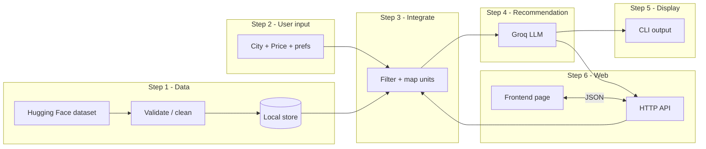

# Zomato AI Restaurant Recommendation Service — Architecture

This document describes a **phase-wise** architecture for a restaurant recommendation service built on the dataset [ManikaSaini/zomato-restaurant-recommendation](https://huggingface.co/datasets/ManikaSaini/zomato-restaurant-recommendation) (~51k rows; available as Parquet via Hugging Face). Users provide **city** and **price** (budget), and optional **preferences** for LLM reasoning. **Phase 5** is the **CLI**; **Phase 6** adds a **browser frontend** backed by a small HTTP API. Deployment, hosting, and CI/CD are **out of scope**.

---

## Goals and constraints

| Input | Purpose |
|--------|--------|
| **City** | Geographic filter (exact or normalized name match). |
| **Price** | Budget filter — typically aligned with “cost for two” or a similar price field in the dataset; map user input to the same unit as the data at integration time. |
| **Preferences** (optional) | Free-text or structured hints (cuisine, vibe, dietary) passed to the **Groq LLM** in Step 4 for personalized ranking and explanations. |

**Non-goals for this document:** production deployment, scaling, or infrastructure.

---

## High-level system view

After all phases, data flows: **dataset → stored/processed catalog → user filters → Groq LLM ranking → CLI (Phase 5) or web UI + API (Phase 6)**.



*Phase 6 reuses the same core pipeline as Phases 3–5; the API is a thin wrapper that returns structured JSON for the frontend.*

---

## Phase 1 — Input the Zomato data

**Objective:** Load the Hugging Face dataset into a reproducible, query-friendly form for your application.

| Activity | Description |
|----------|-------------|
| **Acquire** | Use the `datasets` library or direct Parquet download from the dataset repo; pin a **revision** or snapshot for reproducibility. |
| **Inspect schema** | Open a sample and list columns (e.g. city, price/cost, rating, cuisines, name). Align naming with your code models. |
| **Validate** | Check required fields, types, and allowed ranges; log or drop rows that break critical constraints. |
| **Clean** | Normalize city strings (case, whitespace), handle missing values, standardize price to a single numeric field used everywhere downstream. |
| **Persist (dev)** | Store as **Parquet** and/or **SQLite** (or in-memory for tiny prototypes) so Step 3 can filter without re-downloading. |

**Deliverable:** A versioned local artifact (e.g. `data/processed/restaurants.parquet`) plus a small data contract (expected columns and types).

---

## Phase 2 — User input

**Objective:** Define how the user supplies **city** and **price** and how those inputs are validated before use.

| Component | Responsibility |
|-----------|------------------|
| **Input surface (Phase 5)** | **CLI** prompts or flags for `city`, `price`, and optional `preferences`. |
| **Input surface (Phase 6)** | Same fields via a **web form**; values are sent to the backend API (see Phase 6). |
| **Validation** | Non-empty city; price &gt; 0; optional max length and sanitization for city. |
| **Semantics** | Document whether `price` is “max budget for two” or another rule so Phase 3 maps it correctly to dataset fields. |

**Deliverable:** A clear input schema (e.g. JSON) and validation rules shared by the **CLI (Phase 5)** and the **web client (Phase 6)**.

---

## Phase 3 — Integrate

**Objective:** Connect user inputs to the processed dataset with consistent units and filters.

| Activity | Description |
|----------|-------------|
| **City match** | Filter rows where city matches (exact match first; optional fuzzy match or alias table for typos later). |
| **Price filter** | Apply budget: e.g. `restaurant_price_for_two <= user_price` (or your chosen field and comparison). |
| **Unit alignment** | Ensure user `price` and dataset price use the same currency and scale (e.g. INR, “for two”). |
| **Service boundary** | Expose a function or module, e.g. `get_candidates(city, max_price) -> DataFrame or list`, used only by the recommendation layer. |

**Deliverable:** A single integration module that returns the **candidate set** for a given (city, price).

---

## Phase 4 — Recommendation

**Objective:** Turn the **candidate set** from Step 3 into a **personalized ordered list** using a **large language model on Groq** (LLM API) for reasoning over structured restaurant rows plus user context.

| Concern | Approach |
|---------|----------|
| **Model** | Call **Groq**’s chat/completions API with a fixed system prompt and a user message that includes **trimmed candidate records** (only fields needed to decide: name, area, rating, price, cuisines, etc.). |
| **Inputs to the LLM** | City, budget, optional **preferences**, and the candidate list (cap list size, e.g. top 30–50 by a cheap pre-filter such as rating, to fit context limits). |
| **Output** | Ask the model for **structured output** (e.g. JSON): ordered restaurant IDs or names, **top-K**, and short **rationales** per pick. Parse and validate before Step 5. |
| **Safety & quality** | Constrain the model to **only** recommend from the provided candidates; on parse failure, fall back to a deterministic order (e.g. sort by rating). |
| **Secrets** | Store **Groq API key** in environment variables, not in source control. |

**Deliverable:** `recommend(candidates, city, price, preferences?) -> ranked list + optional reasons`, implemented via Groq, with documented prompts and fallback behavior.

**Optional dev aid:** A trivial deterministic ranker can exist for offline tests without calling Groq; production path for this architecture is **Groq-backed**.

---

## Phase 5 — Display to the user

**Objective:** Present results clearly and consistently.

| Element | Purpose |
|---------|---------|
| **Summary** | Show applied city, budget, and preferences so the user can confirm. |
| **CLI** | Table or numbered list in the terminal; print LLM rationales if returned. |
| **Web (Phase 6)** | Same logical content as cards/list in a browser; driven by the API response schema below. |
| **Empty state** | No matches: suggest relaxing budget or checking spelling of city. |
| **Errors** | Invalid input, Groq/API errors, or data load failures with readable messages. |

**Deliverable:** **CLI output** (`phase_5_display`); **web UI** is specified in Phase 6 without changing Phases 3–4 logic—only the shell (HTTP + browser) is added.

---

## Phase 6 — Web frontend and backend API

**Objective:** Provide a **single-page (or multi-page) frontend** where the user enters **locality** (Bangalore area), **max budget for two**, and optional **preferences**, then sees **ranked recommendations** with rationales. A **backend HTTP service** exposes the same pipeline as the CLI and returns **JSON** for the UI to render.

### Frontend (browser)

| Element | Description |
|---------|-------------|
| **Form** | Fields: `city` (text), `price` (number), `preferences` (optional textarea), `top_k` (optional, default e.g. 10). Client-side basics: required fields, positive price. |
| **Submit** | On submit, send a **POST** request to the backend (see below); show loading state. |
| **Results** | Render a list or cards: name, rating, cost for two, location, cuisines, optional “Why” (rationale). |
| **Empty / errors** | If API returns no matches, show guidance (increase budget, check spelling). If **4xx/5xx**, show a friendly message from `error` or status text. |
| **Stack (suggested)** | Any SPA or server-rendered stack (e.g. React/Vue/Svelte, or plain HTML + fetch); not prescribed here. |

### Backend (HTTP API)

| Concern | Approach |
|---------|----------|
| **Role** | Thin **REST** layer: validate payload, call existing `run_pipeline` (or equivalent: `parse_user_input` → `load_processed_parquet` → `get_candidates` → `recommend`), map result to JSON. |
| **Data path** | Server reads **`restaurants.parquet`** from a configured path (env var e.g. `RESTAURANTS_PARQUET`); same file as Phase 1 output. |
| **Secrets** | **`GROQ_API_KEY`** only on the server; never sent to the browser. |
| **CORS** | If frontend is on a different origin/port during dev, enable **CORS** for that origin on the API (e.g. FastAPI/Flask middleware). |

### Integration: how frontend and backend communicate

1. **Transport:** **HTTPS** in production; **HTTP** on localhost for development (e.g. UI on `http://localhost:5173`, API on `http://localhost:8000`).
2. **Request — recommend**

   `POST /api/recommend`  
   `Content-Type: application/json`

   ```json
   {
     "city": "Banashankari",
     "price": 1500,
     "preferences": "vegetarian friendly",
     "top_k": 8
   }
   ```

3. **Response — success (200)** — body is JSON, shape stable for the UI:

   ```json
   {
     "ok": true,
     "summary": {
       "city": "Banashankari",
       "max_price_for_two": 1500,
       "preferences": "vegetarian friendly"
     },
     "used_fallback": false,
     "items": [
       {
         "name": "Example Diner",
         "rate_numeric": 4.5,
         "approx_cost_for_two": 600,
         "location": "Banashankari",
         "cuisines": "South Indian",
         "rationale": "Short LLM explanation."
       }
     ]
   }
   ```

   If there are **no candidates**, return **200** with `"items": []` and optional `"message"` for empty state (or reuse `ok` + human-readable `message`).

4. **Response — validation error (422)** — invalid `city`/`price`:

   ```json
   {
     "ok": false,
     "error": "city is required"
   }
   ```

5. **Response — server error (500)** — Parquet missing, Groq failure after fallback handling, etc.:

   ```json
   {
     "ok": false,
     "error": "Could not load restaurant data."
   }
   ```

6. **Idempotency / rate limiting:** Reads are **idempotent**; optional **rate limiting** on `POST /api/recommend` to protect Groq quota (not required for architecture, recommended for production).

**Deliverable:** Runnable **API process** + **static or SPA frontend** that uses the contract above; core Python phases **1–5** remain the source of truth for business logic.

---

## Suggested module layout (reference)

This is a logical layout, not a mandate. Implemented packages use descriptive folder names:

```
phase_1_data_loading/   # load, clean, save (Hugging Face → Parquet)
phase_2_user_input/     # schemas + validation
phase_3_integrate/      # filter by city + price → candidates
phase_4_recommendation/ # Groq LLM prompts + JSON parse + fallback ranker
phase_5_display/        # CLI pipeline + formatting
phase_6_web/            # structured pipeline, FastAPI (api.py), static UI (ui/)
```

---

## Data and evaluation notes

- **Reproducibility:** Pin dataset revision and record preprocessing steps.
- **Quality:** Spot-check a few cities manually against known names.
- **Metrics (optional):** If you later add labels or user feedback, you can measure ranking quality; not required for the six phases above.

---

## Phase checklist

| Phase | Focus | Done when |
|-------|--------|-----------|
| **1** | Ingest Zomato data | Clean, stored artifact + schema known |
| **2** | User input | City + price (+ prefs) via **CLI**; validated |
| **3** | Integrate | Candidates by city + price in one API |
| **4** | Recommendation | **Groq LLM** returns ranked top-K (+ rationales) from candidates |
| **5** | Display | **CLI** shows results (`phase_5_display`) |
| **6** | Web | **Frontend** + **HTTP API**; JSON contract; Groq key server-side only |

This completes the architecture for phased development **without** a deployment step (Phase 6 can still be built and run locally).
